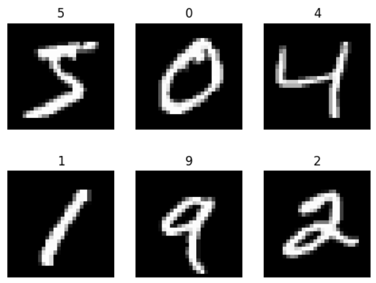
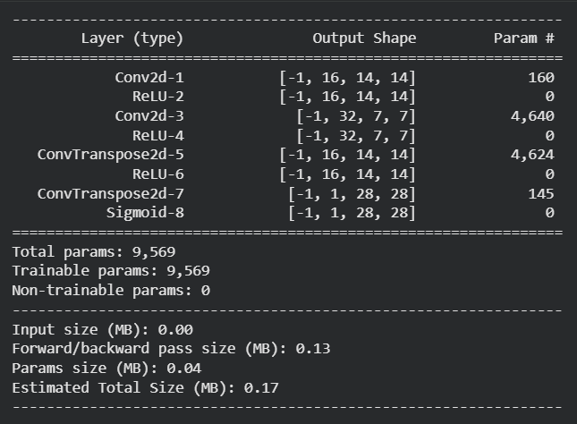
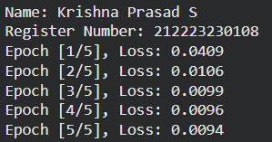
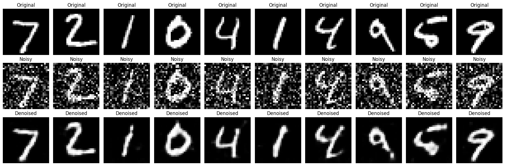

# DL- Convolutional Autoencoder for Image Denoising
## AIM
To develop a convolutional autoencoder for image denoising application.

## Problem Statement and Dataset
This code implements a Denoising Autoencoder using PyTorch to clean noisy images from the MNIST dataset. It uses a convolutional neural network architecture, where the encoder compresses the input image into a lower-dimensional representation, and the decoder reconstructs the original image from this compressed form. To train the model to remove noise, Gaussian noise is added to the clean images, and the network learns to recover the original from the noisy version. The training process uses Mean Squared Error (MSE) as the loss function to measure the reconstruction error and the Adam optimizer to update the model weights. The autoencoder is trained over multiple epochs using mini-batches of data for efficiency. After training, the model's performance is visually evaluated by displaying the original, noisy, and denoised images side by side.



## DESIGN STEPS
### STEP 1: 
Problem Understanding and Dataset Selection

### STEP 2: 
Preprocessing the Dataset

### STEP 3: 
Design the Convolutional Autoencoder Architecture

### STEP 4: 
Compile and Train the Model

### STEP 5: 
Evaluate the Model

### STEP 6: 
Visualization and Analysis


## PROGRAM

### Name: Krishna Prasad S

### Register Number: 212223230108

```python
# Autoencoder Definition
class DenoisingAutoencoder(nn.Module):
    def __init__(self):
        super(DenoisingAutoencoder, self).__init__()

        self.encoder = nn.Sequential(
            nn.Conv2d(1, 16, kernel_size=3, stride=2, padding=1),
            nn.ReLU(),
            nn.Conv2d(16, 32, kernel_size=3, stride=2, padding=1),
            nn.ReLU()
        )

        self.decoder = nn.Sequential(
            nn.ConvTranspose2d(32, 16, kernel_size=3, stride=2, padding=1, output_padding=1),
            nn.ReLU(),
            nn.ConvTranspose2d(16, 1, kernel_size=3, stride=2, padding=1, output_padding=1),
            nn.Sigmoid()
        )

    def forward(self, x):
        x = self.encoder(x)
        x = self.decoder(x)
        return x

# Initialize model
model = DenoisingAutoencoder().to(device)
criterion = nn.MSELoss()
optimizer = optim.Adam(model.parameters(), lr = 1e-3)

# Training function
def train(model, loader, criterion, optimizer, epochs=5):
    model.train()
    print('Name: Krishna Prasad S')
    print('Register Number: 212223230108')

    for epoch in range(epochs):
        running_loss = 0.0

        for images, _ in loader:
            images = images.to(device)
            noisy_images = add_noise(images).to(device)

            outputs = model(noisy_images)
            loss = criterion(outputs, images)

            optimizer.zero_grad()
            loss.backward()
            optimizer.step()

            running_loss += loss.item()

        print(f"Epoch [{epoch+1}/{epochs}], Loss: {running_loss/len(loader):.4f}")

# Visualization function
def visualize_denoising(model, loader, num_images=10):
    model.eval()
    with torch.no_grad():
        for images, _ in loader:
            images = images.to(device)
            noisy_images = add_noise(images).to(device)
            outputs = model(noisy_images)
            break

    images = images.cpu().numpy()
    noisy_images = noisy_images.cpu().numpy()
    outputs = outputs.cpu().numpy()

    print('Name: Krishna Prasad S')
    print('Register Number: 212223230108')
    plt.figure(figsize=(18, 6))
    for i in range(num_images):
        # Original
        ax = plt.subplot(3, num_images, i + 1)
        plt.imshow(images[i].squeeze(), cmap='gray')
        ax.set_title("Original")
        plt.axis("off")

        # Noisy
        ax = plt.subplot(3, num_images, i + 1 + num_images)
        plt.imshow(noisy_images[i].squeeze(), cmap='gray')
        ax.set_title("Noisy")
        plt.axis("off")

        # Denoised
        ax = plt.subplot(3, num_images, i + 1 + 2 * num_images)
        plt.imshow(outputs[i].squeeze(), cmap='gray')
        ax.set_title("Denoised")
        plt.axis("off")

    plt.tight_layout()
    plt.show()

```

### OUTPUT

### Model Summary


### Training loss


## Original vs Noisy Vs Reconstructed Image


## RESULT
Therefore, To develop a convolutional autoencoder for image denoising application executed successfully.